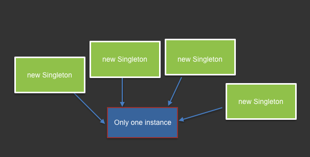

## Singleton

### Image



### Example
Old style:
```javascript
var Singleton = (function(){

    var instance = null;
    var _private_var = 1;

    function Singleton() {
        if (!instance) {
            instance = this;
        }
        else {
            return instance;
        }

        this.public_var = 1;
    }

    Singleton.prototype.getPrivateVar = function () {
        return _private_var;
    };

    Singleton.prototype.getPublicVar = function () {
        return this.public_var;
    };

})();

var a = new Singleton();
var b = new Singleton();

console.assert(a, b);
console.console(a.getPrivateVar());
console.console(a.getPublicVar());
console.console(a._private_var);
console.console(a.public_var);
```
ES6 Style:
```javascript
// Class
let instance = null;

class Singleton {

    constructor() {
        if (!instance) {
            instance = this;
        }
        return instance;
    }

    getData() {
        return Date.now();
    }
}

export default Singleton;

// Test
import Singleton from './singleton';

const a = new Singleton();
const b = new Singleton();

console.assert(a, b);
console.log(a.getData(), b.getData());
```

### Implementations and Links
+ Gang of Four - http://wiki.c2.com/?GangOfFour

+ Wiki - https://en.wikipedia.org/wiki/Singleton_pattern

