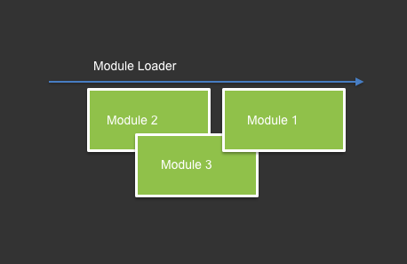

## Asynchronous Module Definition (AMD)

### Image



### Very Simple Example
AMD Implementation:
```javascript
const modulesMap = {};

function checkThatAllLoaded(dependencies) {
  for (let i = 0; i < dependencies.length; i++) {
    const depName = dependencies[i];
    const dep = modulesMap[depName] || {};
    if (!dep.instance) {
      return false;
    }
  }
  return true;
}

function loadModule(name, dependencies) {
  if(checkThatAllLoaded(dependencies)) {
    const module = modulesMap[name];
    const args = dependencies.map(depName => modulesMap[depName].instance)
    module.instance = module.constructor(...args);
    loadRelated(name);
  }
}

function loadRelated(loadedModule) {
  for (let moduleName in modulesMap) {
    const module = modulesMap[moduleName];
    if (!module.instance && module.dependencies.includes(loadedModule)) {
      loadModule(moduleName, module.dependencies);
    }
  }
}

function reqjs(name, dependencies, moduleConstructor) {
  modulesMap[name] = {};
  modulesMap[name].constructor = moduleConstructor;
  modulesMap[name].dependencies = dependencies;
  loadModule(name, dependencies);
}
```
Load different modules:
```javascript
reqjs('m1', ['m2', 'm3'], (m2, m3) => {
  console.log('m1 is loaded');
  m2.call('m1 call m2');
  m3.call('m1 call m3');
});

reqjs('m2', ['m4'], (m4) => {
  console.log('m2 is loaded');
  m4.call('m2 call m4');
  return { call: console.log };
});

reqjs('m3', [], () => {
  console.log('m3 is loaded');
  return { call: console.log };
});

reqjs('m4', [], () => {
  console.log('m4 is loaded');
  return { call: console.log };
});
```
Output:
```
192:sasp archik$ node amd/test.js
m3 is loaded
m4 is loaded
m2 is loaded
m2 call m4
m1 is loaded
m1 call m2
m1 call m3
```

### Implementations and Links
+ AMD.js - https://github.com/amdjs/amdjs-api/wiki/AMD

+ AMD - https://en.wikipedia.org/wiki/Asynchronous_module_definition

+ Requirejs - http://requirejs.org

+ Angular.js 1.x DI - https://docs.angularjs.org/guide/module
