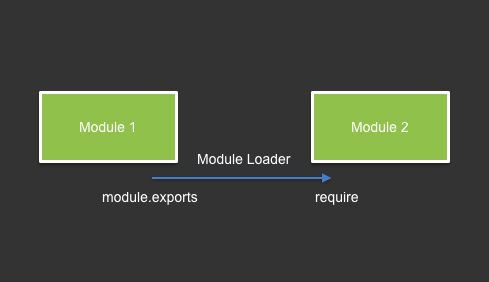

## CommonJS Module

### Image



### Example
Module 1:
```javascript
module.exports = {
  call: console.log
};
```

Module 2:
```javascript
module.exports = {
  call: console.log
};
```

Main script:
```javascript
const m1 = require('./m1.js');
const m2 = require('./m2.js');

m1.call('call m1');
m2.call('call m2');
```
Output:
```
192:sasp archik$ node commonjs/test.js
call m1
call m2
```


### Implementations and Links
+ Commonjs Spec - http://www.commonjs.org/specs/modules/1.0/

+ Commonjs Wiki - http://wiki.commonjs.org/wiki/Modules/1.1

+ Node.js - https://nodejs.org/api/modules.html

+ Browserify - http://browserify.org/
