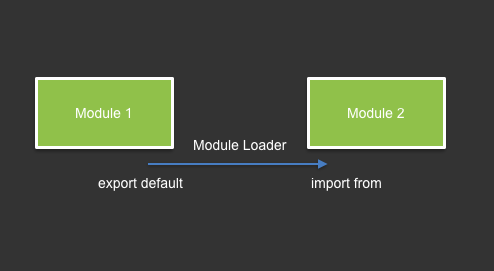

## ES6 Module

### Image



### Example
Module1:
```javascript
class Module1 {
  static call(text) {
    console.log(text);
  }
}

export default Module1;
```
Module2:
```javascript
class Module2 {
  static call(text) {
    console.log(text);
  }
}

export default Module2;
```
Main script:
```javascript
import { Module1 } from './m1.js';
import { Module2 } from './m2.js';

Module1.call('call m1');
Module2.call('call m2');
```
Output:
```
call m1
call m2
```


### Implementations and Links
+ ECMAScript Spec - http://www.ecma-international.org/ecma-262/6.0/#sec-modules

+ MDN import - https://developer.mozilla.org/en-US/docs/Web/JavaScript/Reference/Statements/import

+ MDN export - https://developer.mozilla.org/en-US/docs/Web/JavaScript/Reference/Statements/export
