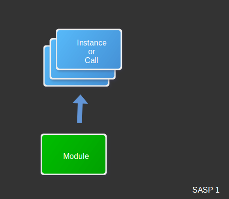

#Module

###Image:



###Example:
```javascript
function Module(global) {
    function add(a, b) {
        return a + b;
    }

    return {
      add: add
    };
}

var module = Module(global);

console.log(module.add(2, 2));
```

