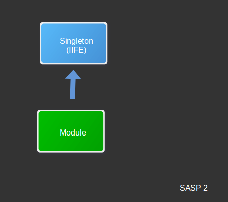

## Singleton Module or Immediately Invoked Function Expression (IIFE)

### Image



### Example
```javascript
var module = (function Module(global){
    function add(a, b) {
        return a + b;
    }

    return {
        add: add
    };
})(global);

console.log(module.add(2, 2));
```
